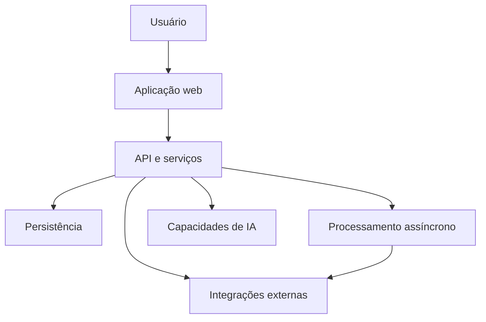
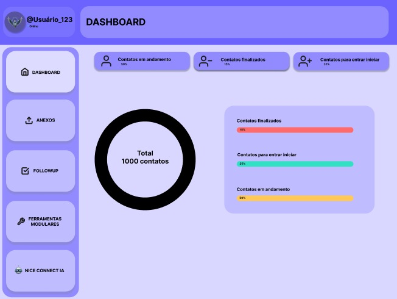
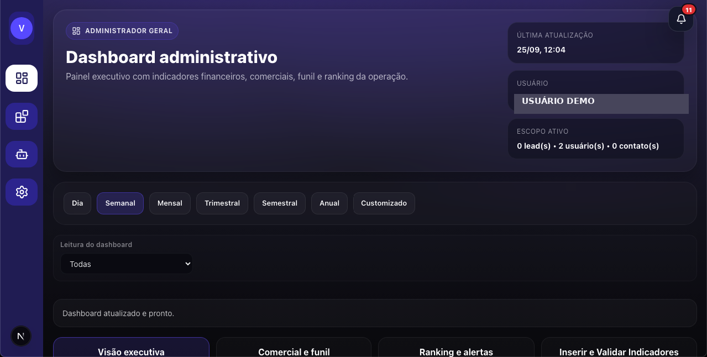
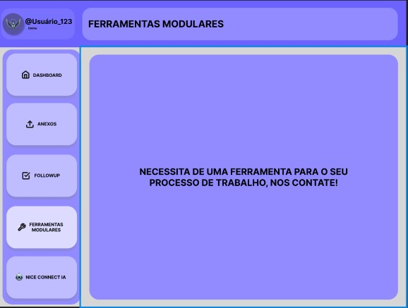
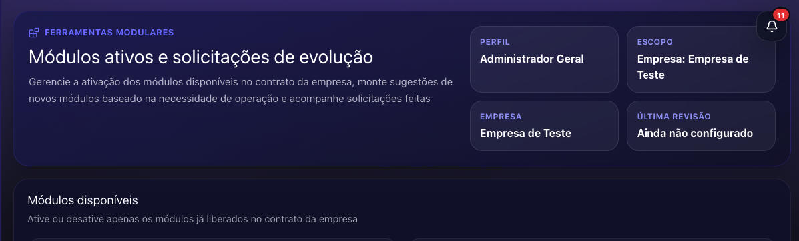
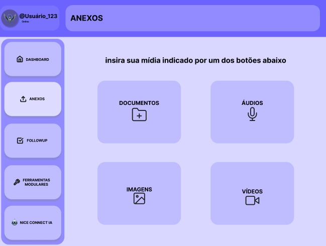
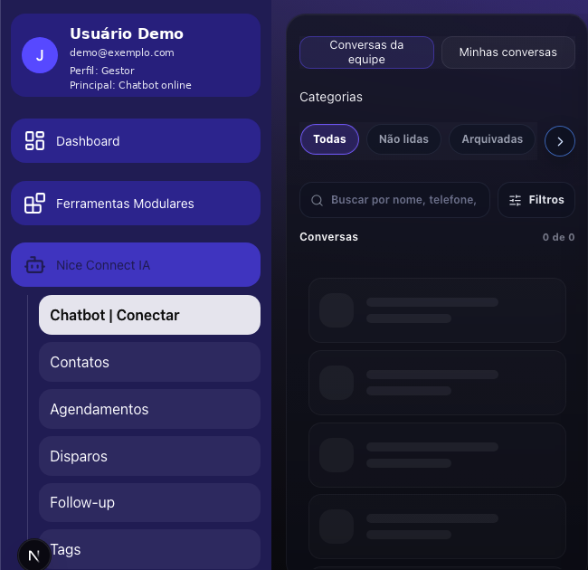

# Nice Connect IA

> Nome atual do projeto; identidade comercial ainda sujeita a evolução.

> Este repositório é um case técnico.
O código-fonte, dados operacionais e regras internas permanecem privados.

Plataforma web adaptável de atendimento, automação e apoio operacional com inteligência artificial. Desenvolvida em colaboração, reúne interfaces de atendimento e organização de atividades conectadas a serviços de backend e integrações externas.

## Sobre o projeto

O Nice Connect IA nasceu da necessidade de reduzir tarefas repetitivas e organizar melhor o trabalho de atendimento. Sua evolução levou à construção de uma aplicação web que integra atendimento humano e automações com IA.

Este case apresenta o contexto do projeto e minha participação Full Stack, concentrada no frontend e complementada por contribuições à evolução do backend e das integrações.

## Como a ideia evoluiu

A proposta inicial era automatizar ações executadas no computador. Um exemplo era obter informações de um lead em um sistema, abrir um canal de comunicação e iniciar um contato, reduzindo a repetição manual dessas etapas.

Essa abordagem foi inicialmente pensada em Python. Durante a evolução da ideia, as limitações de automatizar ações isoladas e o retrabalho associado motivaram uma mudança de direção: centralizar os processos em uma aplicação web.

A sequência de evolução foi:

1. Ideia de automação local, inicialmente pensada em Python.
2. Identificação da necessidade de centralizar os processos.
3. Prototipação no Figma como referência inicial de interface e organização das funções.
4. Desenvolvimento da aplicação web.
5. Aperfeiçoamento contínuo conforme as necessidades do próprio projeto.

Durante essa trajetória, plataformas consolidadas de atendimento, como o Chatwoot, foram estudadas como referência de organização da experiência e de padrões de interação. A implementação e as regras do Nice Connect IA evoluíram conforme as necessidades próprias do projeto.

## Problema abordado

Quando o atendimento depende de ações repetidas em ferramentas separadas, o trabalho exige alternância constante de contexto e acompanhamento manual. Automatizar apenas os cliques mantém parte dessa dependência da operação local.

A proposta do projeto passou a ser reunir atendimento, organização de contatos e acompanhamento de atividades em uma experiência web, com serviços e automações apoiando essas interações.

## Aplicabilidade

O projeto tem uma proposta adaptável a diferentes segmentos e operações. Saúde, consórcios, advocacia e mercado imobiliário são exemplos de contextos considerados, assim como outras atividades comerciais e de atendimento.

Esses exemplos indicam possibilidades de aplicação. Não representam uma lista de clientes ou de implantações comprovadas em cada segmento.

## Minha atuação

O desenvolvimento envolve colaboração. Minha contribuição foi maior na interface, com participação também na evolução estrutural do backend e das integrações.

### Frontend — principal área de atuação

Minha principal contribuição foi a construção da **maior parte da estrutura visual/frontend atual**, com foco na experiência de uso, organização das páginas e integração das interfaces com os serviços da aplicação. Essa atuação se refere à camada de interface e não representa autoria integral do produto ou do backend.

Minha atuação nessa camada abrangeu:

- Estrutura de páginas, layouts e componentes.
- Navegação e organização visual das funcionalidades.
- Adaptação de layouts para diferentes tamanhos de tela.
- Estados e interações da interface.
- Integração das telas com funcionalidades disponibilizadas pelo backend.

Um desafio recorrente foi manter a consistência da experiência enquanto as funcionalidades evoluíam, considerando tanto a organização dos componentes quanto a apresentação de informações e estados dos serviços.

### Backend e integrações — participação e evolução

Minha participação no backend foi menor que no frontend, mas envolveu trabalho de evolução e manutenção estrutural: inclusão e adaptação de ferramentas, reorganização de partes existentes e remoção ou substituição de soluções que deixaram de atender às necessidades do projeto.

Também participei da evolução das integrações de mensageria e da substituição de soluções conforme os requisitos técnicos e operacionais mudaram. Essa contribuição ocorreu em colaboração, sem representar autoria integral do backend.

## Tecnologias

| Área | Tecnologias presentes no projeto |
| --- | --- |
| Interface web | Next.js, React e TypeScript |
| Estilos e interação | Tailwind CSS, CSS Modules e Framer Motion |
| Backend | Node.js, JavaScript e Express |
| Persistência | PostgreSQL |
| Processamento assíncrono | Redis e BullMQ |
| Arquivos | Armazenamento compatível com S3 |
| Integrações | APIs de IA e serviços de mensageria |
| Verificações de engenharia | TypeScript, ESLint, Node Test Runner e Supertest |
| Containerização | Docker |

Python faz parte da abordagem inicialmente considerada. Figma participou da etapa de prototipação. A tabela descreve tecnologias encontradas na implementação atual, sem expor sua configuração operacional.

## Arquitetura conceitual

O diagrama mostra a separação de responsabilidades: a aplicação web organiza a experiência do usuário; os serviços conectam as funcionalidades; a persistência mantém os dados; e o processamento assíncrono apoia tarefas em segundo plano. Ele não representa a topologia da implantação.

## Evolução da interface

Antes da implementação atual, o projeto passou por diferentes etapas de prototipação no Figma. Esses estudos ajudaram a transformar a ideia inicial de automação pontual em uma experiência web centralizada, com navegação entre módulos, visão operacional e áreas dedicadas a diferentes atividades.

Os protótipos abaixo representam explorações iniciais e não correspondem ao estado atual do produto. Os dados exibidos foram usados apenas para composição e validação visual.

### Do protótipo ao dashboard atual

*Protótipo inicial de uma visão geral operacional. Os números e percentuais são fictícios e não representam métricas reais do projeto.*

*Dashboard administrativo atual, apresentado com conteúdo demonstrativo e identificação pessoal removida.*

A evolução do dashboard mostra a passagem de uma composição visual exploratória para uma interface com hierarquia mais definida, filtros de período e áreas separadas para leitura dos indicadores.

### Ferramentas modulares

*Conceito inicial de uma área destinada a funcionalidades adicionais.*

*Interface atual da área de módulos, preservando a proposta de extensibilidade e reorganizando a experiência em torno do contexto da empresa.*

A ideia de modularidade permaneceu no projeto, mas a apresentação e o contexto de uso foram refinados durante o desenvolvimento.

### De “Anexos” para conteúdo dentro das conversas

*No protótipo, documentos, áudios, imagens e vídeos apareciam como uma área independente.*

*Na implementação atual, o atendimento e o conteúdo relacionado às interações passaram a fazer parte da experiência central de conversas do Nice Connect IA. A captura foi sanitizada para uso público.*

O conceito de **Anexos** não permaneceu como uma aba isolada. Conforme a aplicação evoluiu, o conteúdo associado ao atendimento passou a ser tratado dentro do fluxo de conversas, aproximando arquivos e interações do contexto em que realmente são utilizados.

Esses registros documentam não apenas uma mudança estética, mas uma mudança na organização do produto: elementos que inicialmente eram pensados como módulos independentes foram sendo reposicionados conforme os fluxos de uso ficaram mais claros.

## Decisões de engenharia

**Centralização em uma aplicação web.** A mudança ampliou o escopo em relação à ideia inicial de automação local: além das interações, passou a ser necessário considerar serviços, persistência e integração entre camadas.

**Separação entre interface e serviços.** Essa organização permite trabalhar na experiência visual e na evolução do backend, exigindo atenção à compatibilidade entre as duas partes.

**Componentes e estados de interface.** A organização das telas e o tratamento de carregamento, informação e falhas fazem parte do trabalho de conectar a experiência visual às funcionalidades disponíveis.

**Processamento assíncrono.** O projeto utiliza tarefas em segundo plano para apoiar funcionalidades além da interação imediata com a interface.

**Evolução das integrações.** As soluções de mensageria foram avaliadas e adaptadas conforme as necessidades mudaram, incorporando manutenção de integrações ao desenvolvimento do produto.

Esses desafios relacionam trabalho de interface, comunicação entre camadas e manutenção de serviços, compondo o caráter Full Stack da minha participação.

## Qualidade

O projeto contém ferramentas de tipagem, lint e testes, além de migrações, controle de acesso, containerização e tratamento de erros. Há verificações relacionadas a integrações no backend.

Essas práticas fazem parte da engenharia do projeto. Este case não apresenta métricas de cobertura, desempenho ou resultados comerciais, nem atribui garantias de qualidade apenas à presença dessas ferramentas.

## Privacidade do projeto

Este repositório se destina exclusivamente à apresentação de um case técnico. Permanecem privados:

- Código-fonte e implementação.
- Dados de clientes e informações operacionais.
- Workflows, regras de negócio e automações internas.
- Configurações e integrações operacionais.

O material público se limita ao contexto, à evolução, às tecnologias e ao escopo da contribuição profissional.

## Estado do projeto

O Nice Connect IA continua em evolução. A interface, os serviços e as integrações são aperfeiçoados conforme as necessidades identificadas durante o desenvolvimento, preservando o caráter colaborativo do trabalho.
